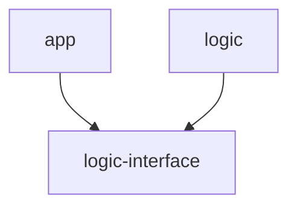

# ADR 2: Extract game logic to a separate submodule

## Status

Proposed

## Context

Game project consists of the application and game logic code.
The application code contains endpoints and services for communicating with the client application and managing the game session lifecycle.
That part of the project is expected to be settled and have only slight changes after the initial release.
The game logic part on the other side is where the all game mechanics and balance logic is located and therefore can change more often.
The biggest necessity to make it separate is not to share it as part of the main open source project and not to spoil the fun of exploring the game. 
Game logic code can be published as open source with a delay, when the new set of game logic code is developed.
## Decision

We will keep game logic in a separate gradle module residing in a git submodule, added to the application during the build process.
To separate these modules a new interface module will be requried (`game-logic-interface`).

The suggested git tree:

    
    app/
    logic-interface/
    logic/ (git submodule)
    build.gradle

The compilation dependencies will look like this:

The `logic` dependency should be runtime only and optional (implemented via gradle `feature variant`)

The app project can contain some sample logic to have a technically functional application but not a full game.

## Consequences

The application project is split into separate modules, which can have different visibility and lifecycle.
Git submodules are used.